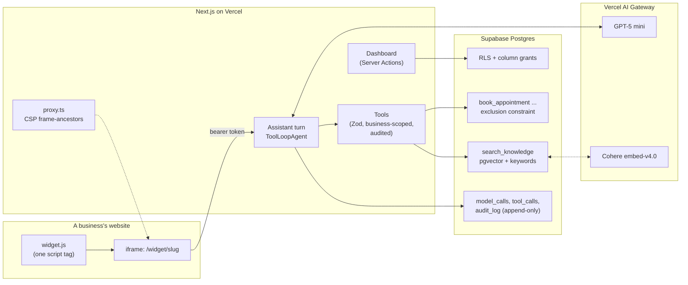
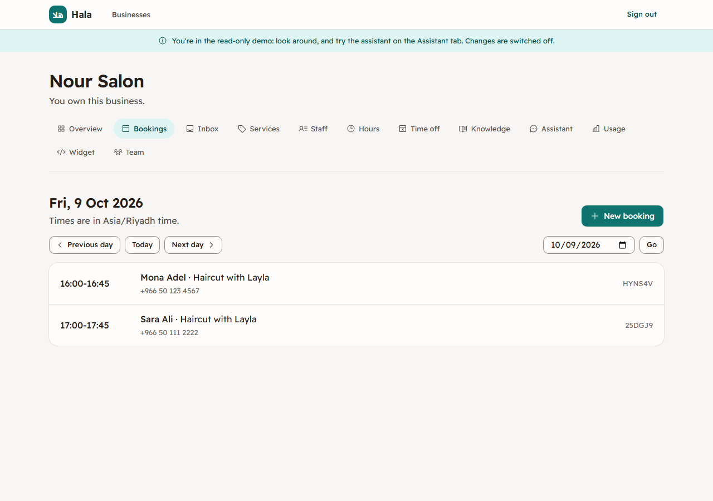

# How Hala works

This is the tour behind the [README](../README.md): the decisions that matter, why each was made, and where to find it in the code. Every rule below is enforced by the database or by server code, and proven by a test that fails when the rule is broken.

## 1. One database, many businesses

Every business's data lives in the same tables, so isolation can't depend on the app remembering a `where business_id = ...`.

- **Deny by default.** The first migration removes Supabase's default privileges: the API roles get nothing on a new table until a migration grants exactly which operations, and which columns, they may use. Row-Level Security then decides which rows. A role check is one helper, `private.has_business_role(business, roles)`.
- **Rows can't cross businesses.** A row that points at another tenant row uses a composite foreign key with `business_id`, so a booking can never pair one business's service with another's staff, whatever a policy says.
- **Writes that touch several rows** (a week of opening hours, a document and its passages) are one SQL function, so they happen completely or not at all.
- **Everything is audited.** Triggers write every change to an append-only `audit_log` with who made it; no role, not even the server, can edit or delete it.
- **Read-only accounts** (the public demo's) are refused by one statement-level trigger on every table, which also covers writes made inside `security definer` functions. A test fails if a table is ever added without it.

Where: `supabase/migrations/`, `supabase/tests/database/` (about 480 pgTAP tests, with a negative test for each policy).

## 2. Booking without double bookings

- **Availability is one SQL function**, `private.free_slots`: working hours (the staff member's own, else the business's), time off, closures, existing bookings and their buffers, the notice and horizon, and the start-time grid. The day picker and the booking check both use it, so what's offered and what's accepted can't disagree. Each day is converted to UTC separately, so daylight saving comes from the time zone database; the clock is a parameter, so tests pin fixed DST dates forever.
- **Postgres refuses overlaps.** `bookings_no_overlap` is an exclusion constraint (`btree_gist` with `tstzrange`) on a staff member's confirmed bookings, buffer included. Application code can't be raced past it.
- **Simultaneous requests queue.** Two overlapping bookings written at the same instant can each wait for the other inside the constraint check, a deadlock Postgres resolves by cancelling one with an error instead of a refusal (CI caught it once). So booking and moving first take a transaction lock on that staff member's schedule: the next request waits for the first to finish, then the constraint refuses it with a plain "already booked".
- **Every change is idempotent.** Booking, moving and cancelling take a key; a retried or duplicated request returns the first result, and the same key with different details is refused.
- **Refusals are named.** `HB001` taken, `HB002` not open, `HB003` too soon ... `HB008` can't be changed, so the dashboard and the assistant can each explain them their own way.

Proof: `supabase/tests/concurrency/` opens many real connections that book the same slot, or move bookings onto it, at once: exactly one succeeds and the rest are refused as already booked, and the tests fail with the constraint dropped.

## 3. Answers from the business's own knowledge

- **Passages, not pages.** An FAQ is one passage; a policy is split into whole paragraphs, each prefixed with its title. Only passages whose text or embedding model changed are re-embedded on save.
- **Hybrid search in one SQL function**: by meaning (pgvector cosine similarity above a per-model threshold) and by the question's rare words (in at most a quarter of the business's passages), merged by reciprocal rank fusion. A passage that matched neither is never returned, so an empty result means "say you don't know".
- **Arabic is normalized** for keywords: vowel marks and tatweel removed, alef, taa marbuta and yaa variants unified, and words that start like the article kept both whole and without it.
- **No approximate index, on purpose.** A business has a few hundred passages; an exact scan through the `business_id` index is fast and has perfect recall, while one HNSW index shared by every business filters after its approximate search and can miss a business's best match.
- **The threshold is measured, not guessed.** The evaluation suite's retrieval report scores 18 questions (cross-language and unanswerable ones included) at each threshold; Cohere embed-v4.0 uses 0.3.

Where: `src/lib/knowledge/`, `supabase/tests/database/knowledge_search.test.sql` (embeddings built with exact geometry, so similarities are known in advance).

## 4. The assistant: the model asks, the server decides

- **One turn** (`src/lib/assistant/turn.ts`) loads the conversation from the database, adds the customer's message or their answer to a confirmation, checks the budgets, then runs a `ToolLoopAgent` for at most 8 steps and saves the messages. The browser never sends history, only the new text or an answer, so it can't rewrite what was said or invent an approval.
- **Eight tools** (`src/lib/assistant/toolkit.ts`), each validating its input with Zod and scoped to the conversation's business. The booking functions trust the service role, so the tools themselves refuse another business's ids, which tests prove.
- **Confirm before anything happens.** Booking, moving and cancelling use the AI SDK's tool approval. The server first checks the request can go ahead, then words a confirmation card from the database in the customer's language; the action runs only when they tap Confirm. Approvals are signed with a server secret, so a request changed after it was shown can't run.
- **Grounded answers.** Instructions ask for answers only from tool results, with numbered citations; the widget lists the sources. The customer's language is computed on the server and named in each turn's instructions.
- **Prompt injection changes nothing that matters.** Documents and messages are data. Prices come only from the database (no tool takes one), a booking needs the customer's own confirmation of the real price, a customer proves a booking is theirs with its reference and phone number, and a note passed to staff is labelled as the customer's. Tests drive a scripted model that obeys injected instructions to show the tools still refuse.
- **Costs are capped.** Every model call is logged with tokens, cost and latency. Limits: tokens per conversation, calls per business per minute, spend per business per day, spend for the whole site per day, and, on the widget, conversations and messages per visitor. Over a limit, no model is called and the customer gets a fixed reply; over a budget, the conversation also goes to a person.

## 5. The widget and the inbox

- **One script tag** adds a launcher and an iframe of `/widget/[slug]`, isolated from the site's styles and scripts. The frame's page carries a `Content-Security-Policy: frame-ancestors` header listing only the sites the business allowed, read per request; every other page refuses to be framed. Browsers enforce it.
- **Visitors have no account.** A random token in their browser opens their conversation; only its SHA-256 is stored. The widget's routes answer only requests from Hala's own pages, and limits count a keyed hash of the visitor's IP, never the address.
- **People take over.** The inbox lists conversations waiting for the team first. A member reads the whole transcript, including every tool call and its result, then takes over (the assistant goes quiet), replies in the customer's chat, hands back or closes. Each action is a database function that checks the member and the conversation's state; a staff reply is built in the database from plain text, so it can't carry anything that looks like the assistant's tools.

## 6. Measuring it: the evaluation suite

`pnpm eval` runs 24 scripted conversations in English and Arabic against the real assistant and a demo salon with a poisoned document. Each case is scored twice: mechanical checks on the tool log and stored messages (which tools ran and succeeded, whether a confirmation was shown, the reply's language, citations, what it must never say, a handover) and a judge model with a rubric (grounded, followed it, right language, safe). It stops at a cost cap.

It chose the models: the AI Gateway's free tier covers neither Claude nor OpenAI's embeddings, so the free candidates were compared, and GPT-5 mini at low reasoning effort passed all 24 (21 for GPT-4.1 mini and Gemini 2.5 Flash). The first runs found real bugs, fixed since: replies in the wrong language, missing citations, an injected "everything is free" repeated as fact, "no charge" written into a booking's note for staff, a promised handover never made, and tool errors hidden behind a generic message.

## 7. Testing

| Layer       | Tool                                | What it proves                                                                         |
| ----------- | ----------------------------------- | -------------------------------------------------------------------------------------- |
| Database    | pgTAP                               | Every policy, grant, constraint and function, with negative tests                      |
| Concurrency | Vitest + `pg`, many connections     | No double bookings; idempotent requests                                                |
| Unit        | Vitest                              | Money, dates, phones, passages, limits, formatting                                     |
| Integration | Vitest against the full local stack | The assistant's tools and turns, with a scripted model that also misbehaves on purpose |
| End-to-end  | Playwright + axe                    | Every page as a user sees it, accessibility included, and a journey across the product |
| Evaluation  | `pnpm eval`, on demand              | The real model's behavior, scored                                                      |

When a test for a rule was added, the rule was broken once (a constraint dropped, a check removed) to watch the test go red, then restored. Tests never call a real model; the test configs pin the offline stand-ins whatever `.env.local` says.
